\
\
  

\
\
1.오픈 데이터 해설
================
##  **출처 데이터**
https://www.kaggle.com/datasets/azminetoushikwasi/cr7-cristiano-ronaldo-all-club-goals-stats

##  **데이터 선택 배경**

 '리오넬 메시'와 더불어 탑클래스 평가를 받은
**'크리스티아누 호날두'** 가 **20**년 동안 약 **700**골을 넣었다. 😮👏  그가 많은 골을 넣었던 배경이 무엇인지 알아본다.
 (ex. 패널티가 많아서 그런건지, 70분~90분 선수들이 힘들어하는 시간대에 호날두가 초인적인 능력을 발휘해서 골을 넣을 수 있었는지...)
 그리고 분석한 내용을 바탕으로 **'크리스티아누 호날두'** 가
 앞으로 어떤 시간대 어떻게 골을 얼마나 넣을 수 있을지
 짧게라도 예측하고 싶었다.

## **열 변수는 무엇이 있고, 어떤 특징을 갖는가**
 '크리스티아누 호날두' Goal Data는 698행 15열로 구성된다. 
 부가적인 열 변수 2개 뺴고,
 직접 관련 있는 열 변수는 **id, Season, Competiton, Matchday, Venue, Club, Opponent, Result, Playing_Position, Minute, At_Score, Type, Goal_assist**가 있다. 즉 13개다.
 여기서 특이한점은 13개 변수 중에
**Playing_Position, Type 속성에 결측값이 있다.**
 각각 57개, 15개 값이 NaN이다.

 따라서 결측값을 이용하여 데이터 클린징을 할 수 있다.
 즉 데이터 클린징을 어떻게 할 지 고민하는 시간을 가질 수 있다.😄 👍 😊
 \
 \
 \
__결측값이 있음을 보여주는 사진__

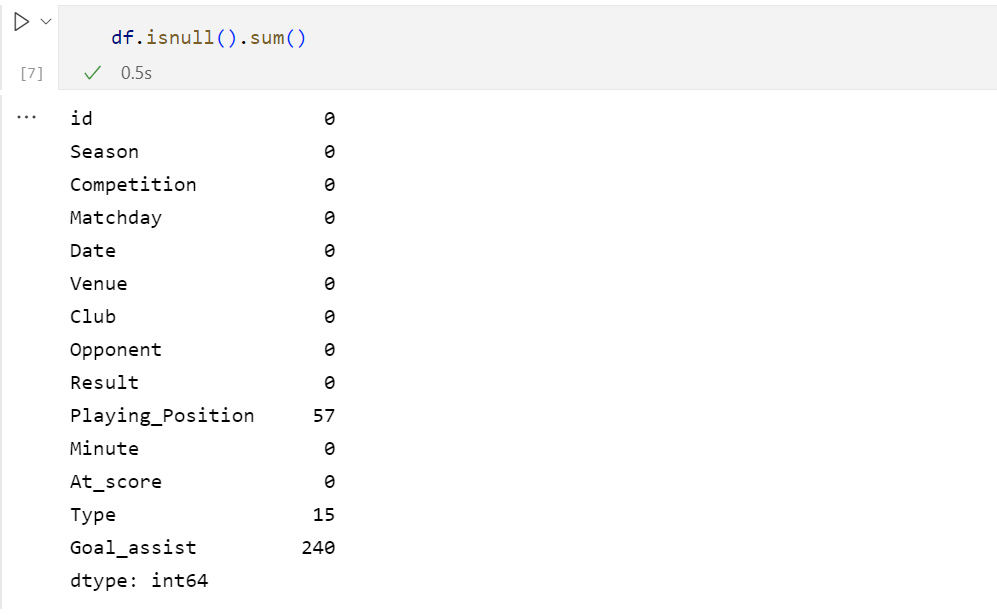
\
\
\
\
 2.데이터보기
============

## **백업한 파일로 전체 데이터를 보여준다**

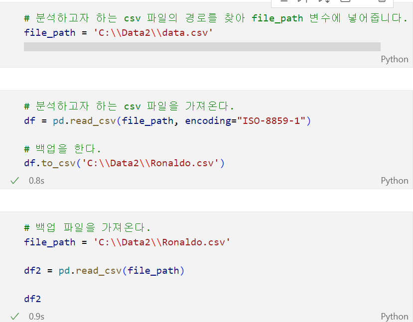

## **전체 데이터 해석은 이렇게!!**

      ex) 0번 행에 대한 데이터 해석
      크리스티아누 호날두는 2002-2003 시즌 포르투갈 1부리그 6라운드 홈경기
      스포르팅 리스본 소속이다. 팀은 Moreiense Fc 상대로 최종 3:0 승리를 거두었다.
      당시 호날두의 포지션은 왼쪽 윙포워드(LW)이다. 그리고 34분에 골을 기록하여 2:0이 되었다.
      골은 Solo run을 통해 넣었고, 어시스트한 선수는 없었다.

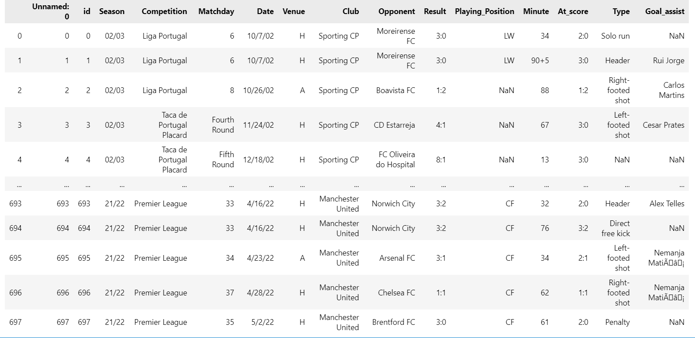
## **info()를 통해 열변수와 Non-Null 갯수, 자료형을 확인한다.**
      사실상 모든 변수가 범주형 변수에 속하며, 자료형은 object이다.
      하지만 object보다 category형으로 자료형을 바꿔주는 것이 분석 시 용량과 속도면에서 효율적이기 떄문에
      category형으로 바꿨다.

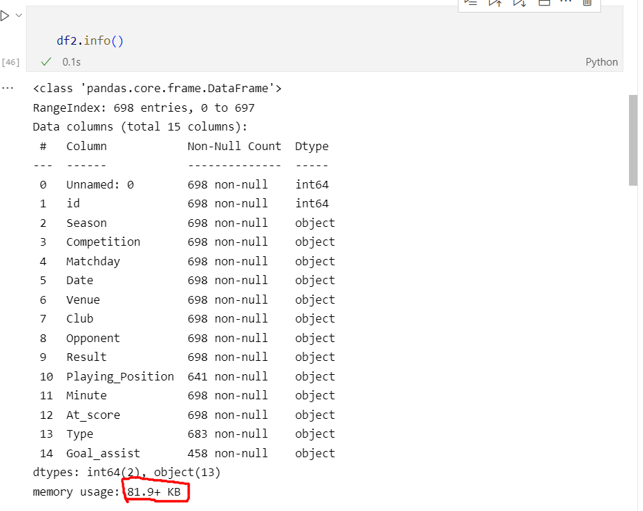

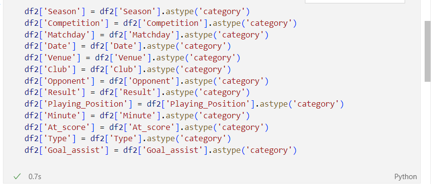

범주형 변수의 자료형을 object에서 category로 변환하니

**메모리 사용량이 81.9+ KB에서 61.5KB로 20 KB**

 낮아졌다.

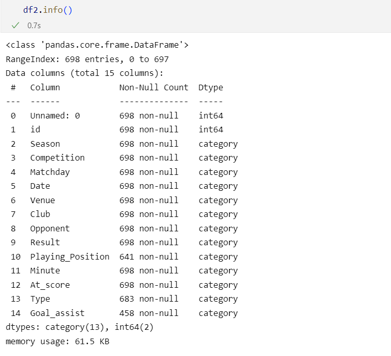
## **loc()를 이용하여 특정 행에 속한 데이터을 파악한다**

loc()을 통해 48행, 102행, 236행, 345행에 있는 Goal 데이터를 보여준다.

즉 호날두의 49골, 103골, 237골, 346골에 대한 데이터를 보여준다.

49호골은 패널티(Penalty), 103호골은 왼발슛(Left-footed shot),
237호골은 패널티(Penalty), 346호골은 오른발슛(Right-footed shot)이다.

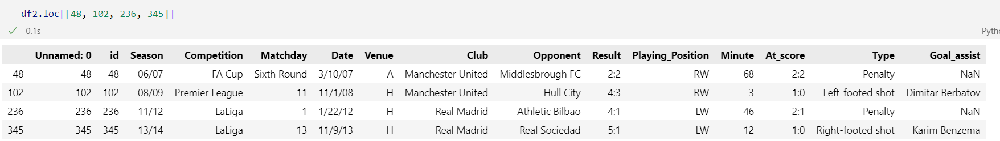
\
\
\
\
\
\
3.데이터 클린징
============

## **데이터 클린징을 위해 고민한 부분**
\
데이터에 있는 결측, 이상, 중복값를 그대로 놔두면 데이터 분석시 변수가 왜곡된다.그 결과 데이터 정확도가 낮아진다. 따라서 데이터 클린징을 한다.

크게 데이터 클린징을 하는 방법은 대체법과 제거법이 있다.

앞서 말했듯이 Playing_Position과 Type 속성에 각각 57개, 15개 결측값이 존재한다.

나는 결측값이 들어있는 행은 지우자고 결심했다. 즉 제거법을 이용해 데이터 클린징을 한다.
\
\
\
\
__결측값이 얼마나 들어있는지 확인하는 사진__

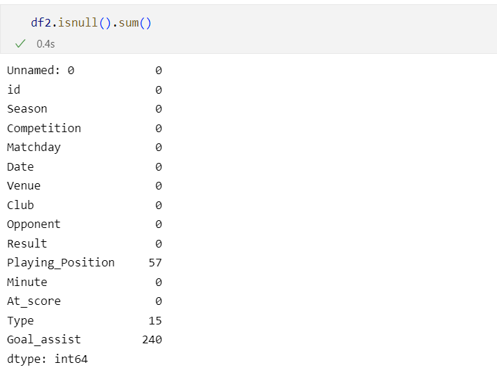
\
\
\
\
\
__'Playing_Position'열에 NaN이 들어있는 행을 모두 출력한 사진__

2행부터 168행까지 비교적 촘촘하게 NaN값이 있다.

\
\
\
\
\
\
__'Playing_Position'열에 NaN이 들어있는 구간을 보여주는 사진__

0행부터 50행까지 RW가 약 20개가 있고, 나머지 포지션은 많아야 5개도 되지 않는다.
51행부터 100행까지 RW가 압도적으로 많아서 0행부터 100행까지 결측값을 RW로 대체할지 생각해봤다.하지만 RW로 바꿀 근거를 찾지 못했다. 그리고 RW로 바꾼다면 데이터 분석에 악영향을 끼칠 것으로 판단했다. 그래서 57개 행을 제거하기로 마음 먹었다.

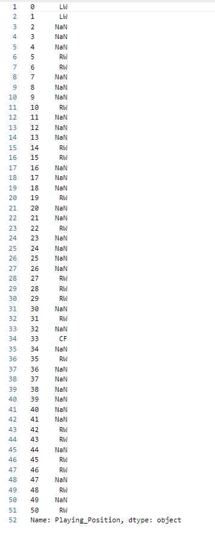

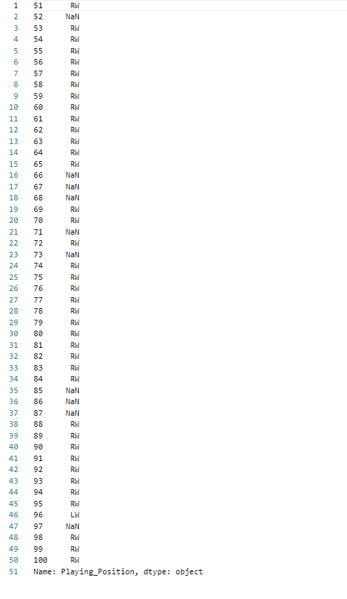

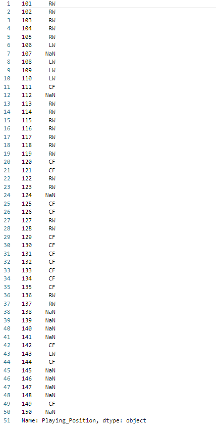

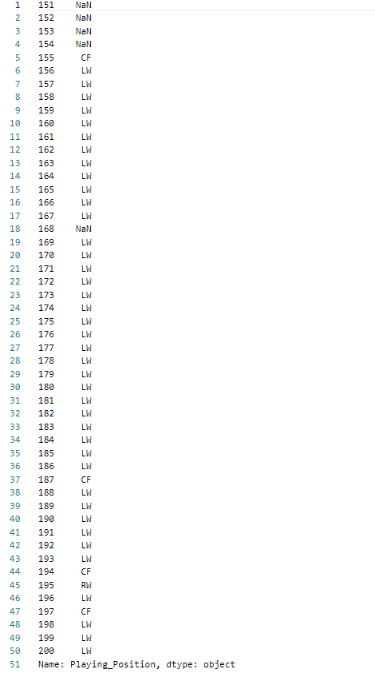

이렇듯 'Playing_Position' 속성에는 결측값이 내가 기대했던 것보다 
많아서 어떻게 처리할지 고민했지만
'Type' 속성은 상대적으로 결측값이 15개밖에 되지 않아서 제거하는게 낫다고 빨리 판단을 내렸다.
\
\
다음을 보자
## **'Playing_Position' 및 'Type' 결측값 제거를 통해 전체 데이터를 나타낸다.**

iloc를 통해, :를 통해 698개의 모든 행을 가져온다.
그리고 1:15를 통해 id부터 Goal_assist까지 모든 열을 가져온다.
dropna()에 있는 subset 속성을 통해, 결측값 관찰할 범위를
'Playing_Position' 및 'Type'로 좁힌다.
dropna()에 how 속성이 있다. how에는 'any' 또는 'all'을 쓸 수 있다.
만약 'any'를 쓴다면 row 또는 column에 NaN값이 1개만 있어도 drop한다. 
하지만 how='any'는 default이므로, 따로 코드로 적지 않았다.

**정리하자면, 약 700개 행을 가져오고, id 부터 Goal_assist까지 13개 속성을 가져온다. 만약 'Playing_Position' 또는 'Type'에 NaN이 있으면 행을 삭제한다.**
\
\
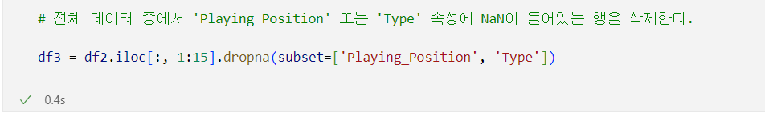
\
\
\
데이터 클린징을 수행한 후  전체 데이터를 가져온다.
처음에 698 rows 였으나 지금은 63 rows가 줄어든 635 rows이다.
\
\
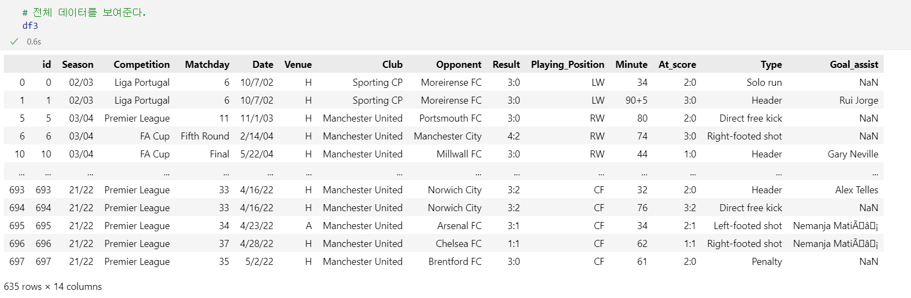
\
\
\
\
'Playing_Position'과 'Type'에 null 값이 있는지 확인한다.
데이터 클린징을 잘 했다면 모두 null값이 0이어야 한다.
결과 화면을 통해 데이터 클린징을 성공적으로 수행한 것을 알 수 있다.

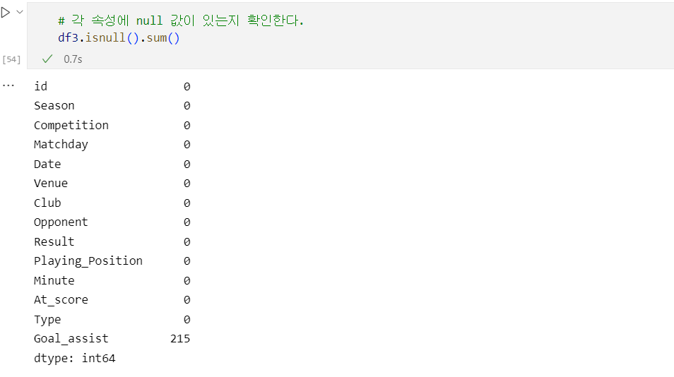
\
\
\
\
\
\
4.데이터 탐색
============

## **데이터 탐색에 대한 개인적 의견**

나는 개인적으로 데이터 탐색이 제일 중요하다고 생각한다. 물론 데이터 클린징도 중요하다. 하지만 어떤 분석 기법을 사용하느냐에 따라 분석의 정확도가 결정된다. 어떤 분석 기법을 사용하느냐가 곧 데이터 탐색이다.

## **어떻게 분석할 것인가??**

골을 어떻게 넣었는지 나타내는 'Type' 속성을 가지고
여러 변수와 이중분석, 다변량 분석을 시도한다.

## **'Playing_Position'과 'Type' 속성을 이용한 이중 변수 분석**

어떤 포지션에서 어떻게 골을 기록했는지 알기 위해 분석했다.

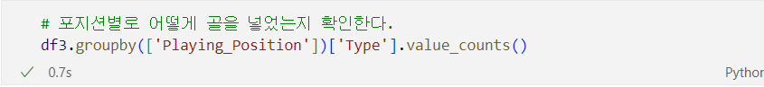

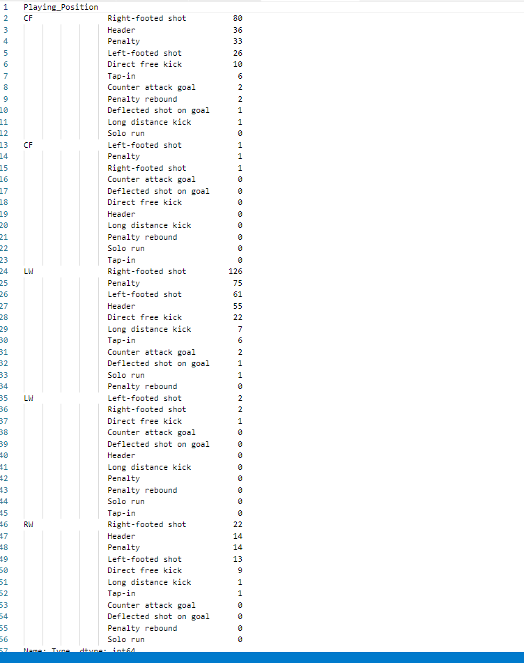

## **'Goal_Division','Type' 속성을 이용한 이중변수 분석**

'Minute'이 문자열형이다. 
나는 이 속성을 int형으로 바꿔서 0 ~ 15분은 1,
16 ~ 30분은 2, 31 ~ 45분은 3, 46 ~ 60분은 4, 
61 ~ 75분은 5, 76 ~ 90분은 6으로 표현하고 싶었다.
하지만 그렇게 하면 골 분포도가 세밀해진다. 그 결과 데이터 분석하기 힘들다. 
따라서 0 ~ 30분은 1, 31 ~ 60분은 2, 61 ~ 90분은 3으로 표현한다.
그러려면 결과를 담을 새로운 파생변수가 필요했다. 그래서 파생변수 Goal_Division 을 만들었다.

파생변수를 만든 이유는 그룹분석을 원활하게 하고 싶었다.

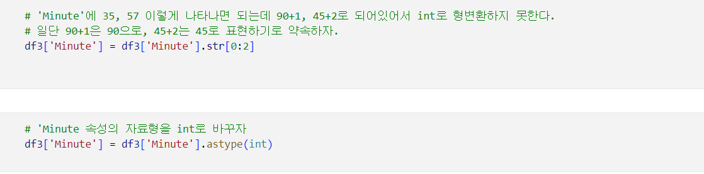
\
\
\
\
\
'Minute' 속성이 'category'에서 'int32'로 변화됬다.

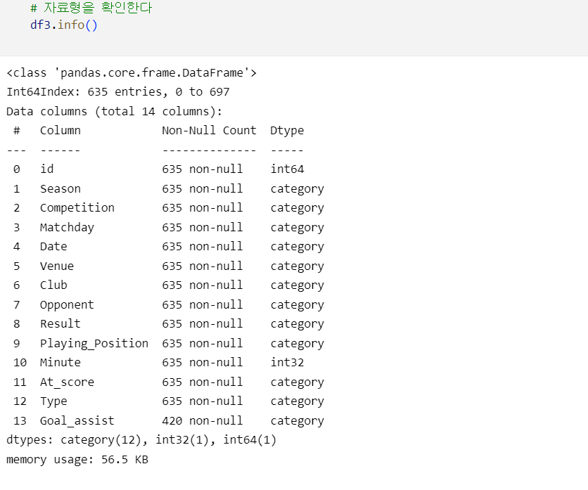
\
\
\
\
\
\
'Minute' 속성의 값을 하나씩 확인한다.
이 값을 func() 함수 매개변수로 넘긴다.
매개변수의 값에 따라 조건에 따라 1 또는 2 또는 3이 반환된다.
반환된 값을 파생변수 'Goal_Division'에 하나씩 넣는다.

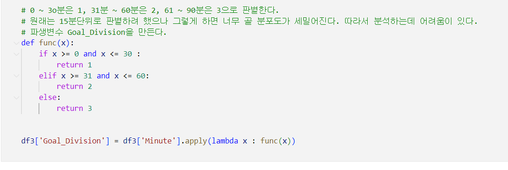
\
\
\
\
\
\
전체 데이터를 출력해서 파생변수가 저장됬는지 확인한다.

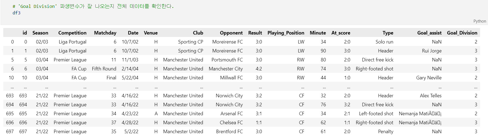
\
\
\
\
\
\
\
Goal_Division을 이용해 그룹분석을 시도한다.

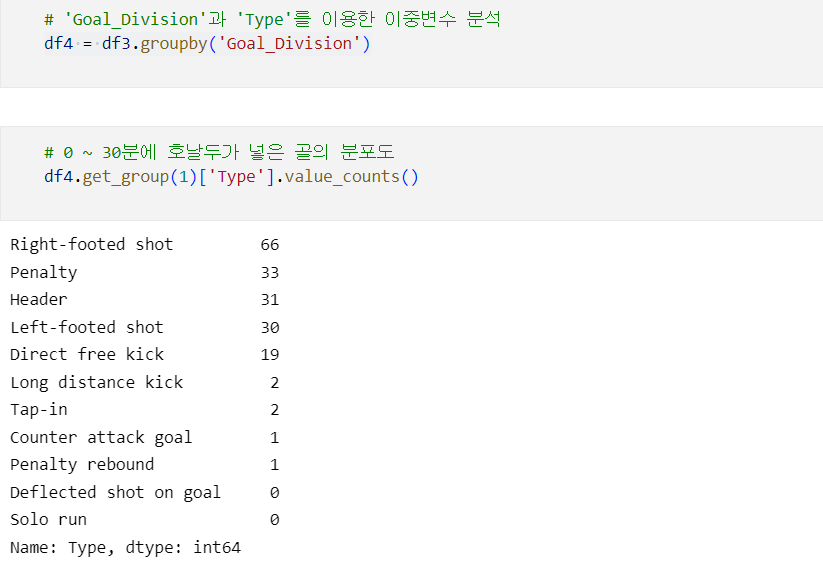

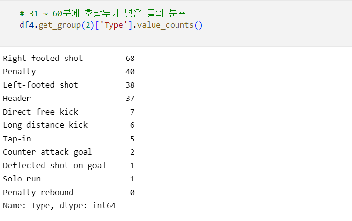

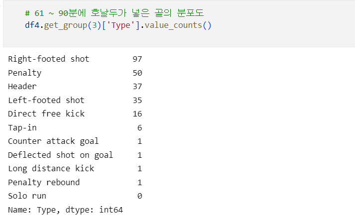

## **'Goal_Division', 'Playing_Position' 그리고 'Type' 속성을 이용한 다변량 분석**

이번 분석은 어떤 포지션에서 뛰면서, 어떤 시간대에, 어떻게 골을 넣었는지 분석하는 것이다.

사실 4개, 5개 변수를 이용해 다변량 분석하고 싶었다.
하지만 그렇게 하기에 내 실력이 부족하다.
따라서 3개 변수를 이용해 분석한다.

이번 분석이 내가 가장 공들인 부분이다.

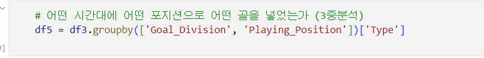
\
\
\
\
\
\
__0 ~ 30분에 어떤 포지션으로 어떻게 골 넣었는지 확인한다.
그리고 이해하기 쉽게 공격 포인트 갯수를 보여준다.__

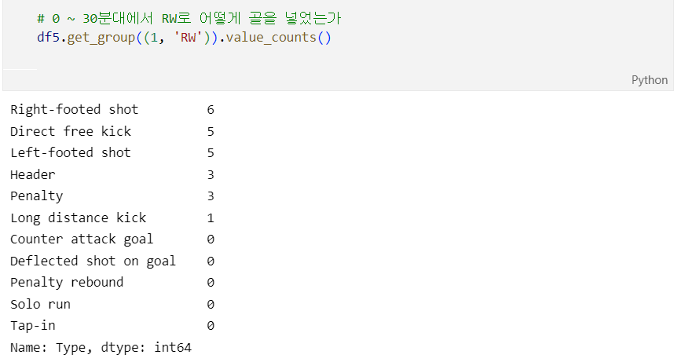

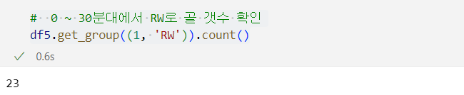

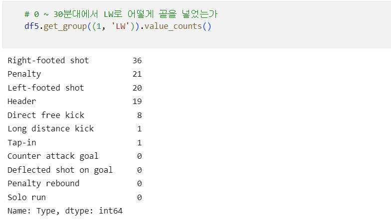

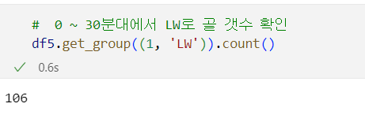

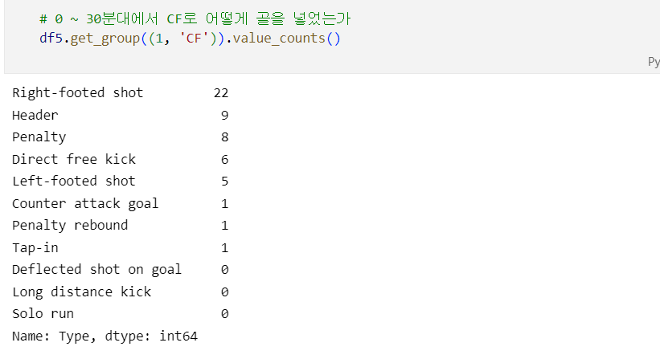

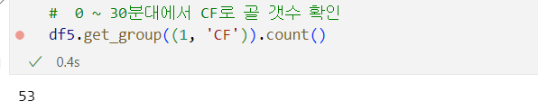
\
\
\
\
\
\
__31 ~ 60분에 어떤 포지션으로 어떻게 골 넣었는지 확인한다.
그리고 이해하기 쉽게 공격 포인트 갯수를 보여준다.__
\
\
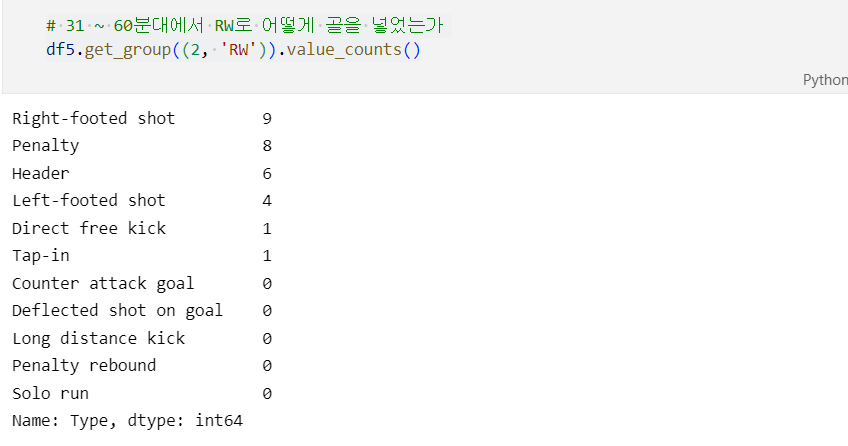

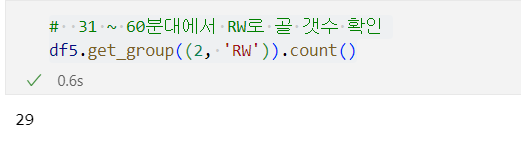

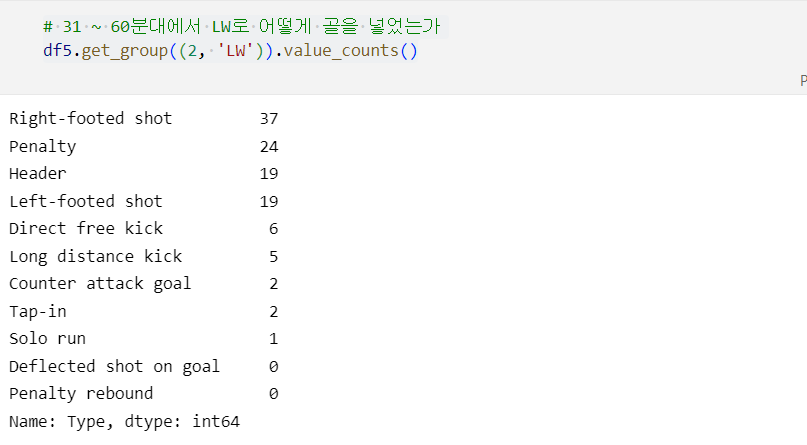

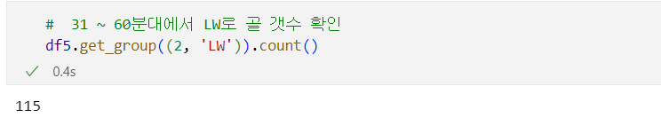

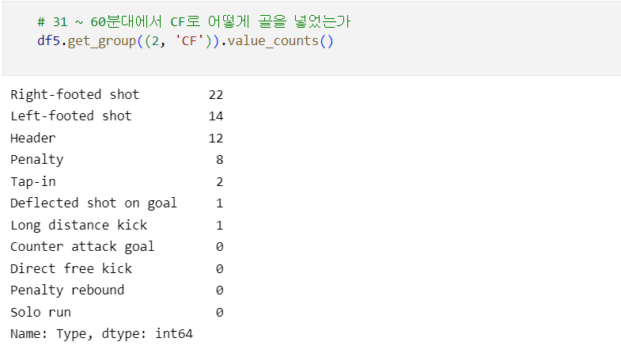

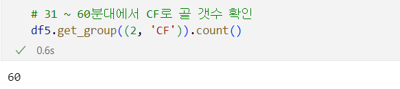
\
\
\
\
\
\
\
__61 ~ 90분에 어떤 포지션으로 어떻게 골 넣었는지 확인한다.
그리고 이해하기 쉽게 공격 포인트 갯수를 보여준다.__

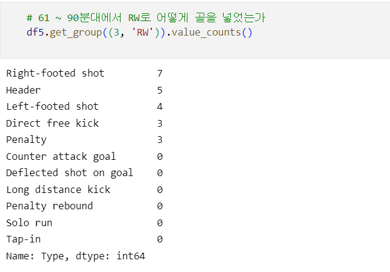

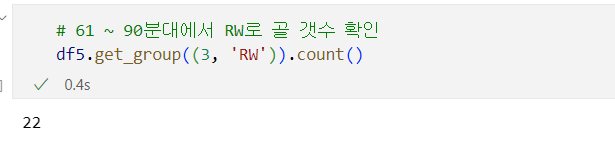

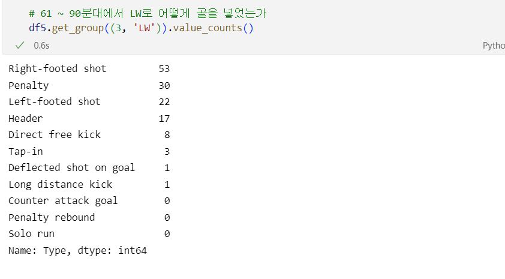

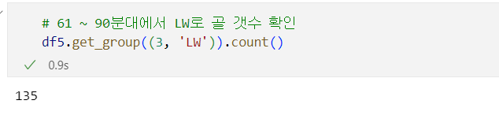

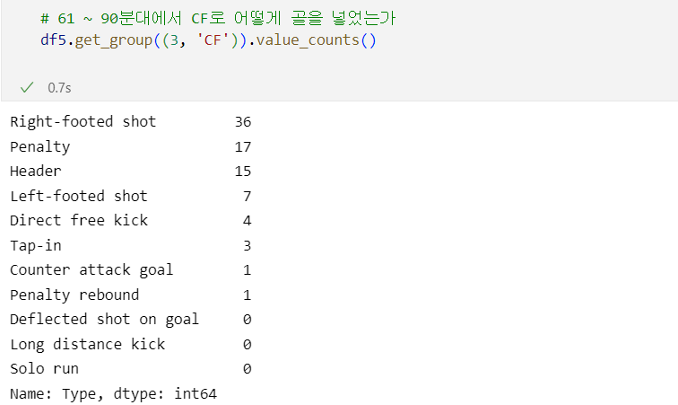

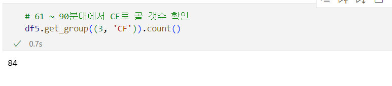
\
\
\
\
\
\
\
5.데이터 시각화
============   

## **Matplotlib 보다 Seaborn을 사용한 이유**

Seaborn은 Matplotlib보다 고급 시각화 기능을 제공한다. 예를 들어 HeatMap과 같은 다양한 그래프를 제공한다. 그리고 코드를 간결하게 써도, 한 눈에 알아볼 수 있는 그림을 만들 수 있다. 
이것이 내가 Seaborn을 선택한 이유다.
두번쨰, HeatMap을 쓰기 위해서다. 시각화에 쓰일 변수가 모두 범주형이기 떄문에 
HeatMap를 선택할 수 밖에 없었다.

## **어떤 변수를 가지고 시각화할 것인가??**

아까 3개 변수를 이용한 다변량 분석 내용을 토대로 시각화할 것이다.

## **시각화 프로세스**

matplotlib.colors 자칭 mcl과 LinearSegmentedColormap은
HeatMap으로 시각화할 떄, 값에 따라 색깔을 진하게, 옅게 하는 역할을 한다.
\
\
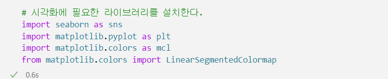
\
\
\
\
새로운 DataFrame를 만들 떄 값으로 넣기 위해
list로 만드는 작업이다.

LW_Goal_List1를 출력했더니 어떻게 골을 넣었는지에 대한 갯수가 나온다.
아래 사진 골 갯수와 같다.

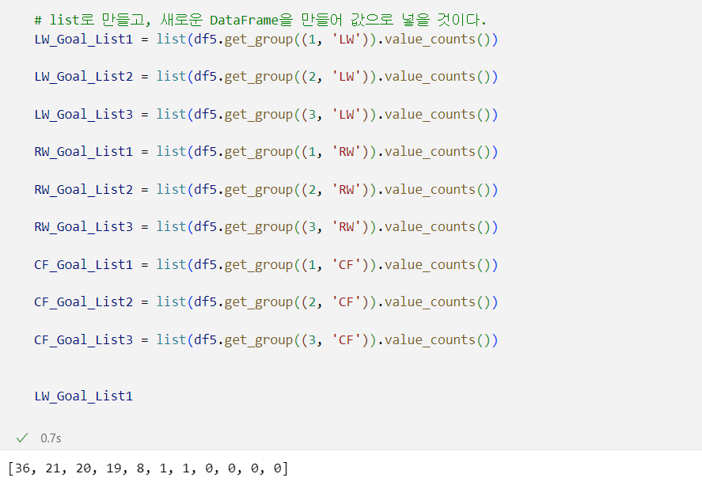

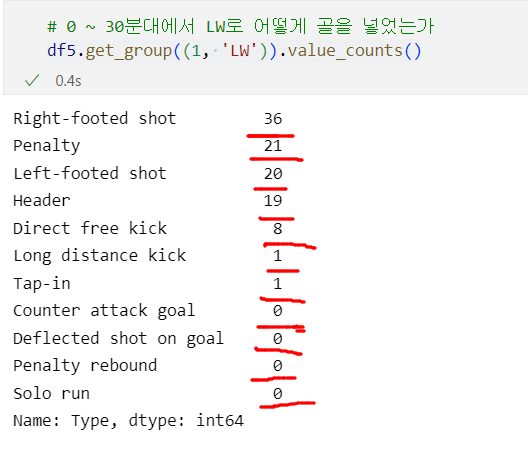
\
\
\
\
새로운 DataFrame를 만들기 위해 x축, y축 그리고 안에 들어갈 값을 넣어준다.
x축은 Goal_Division 역할을 한다.
y축은 Playing_Position + Type 역할을 한다.
안에 들어가는 것은 x축과 y축을 만족하는 값이다.

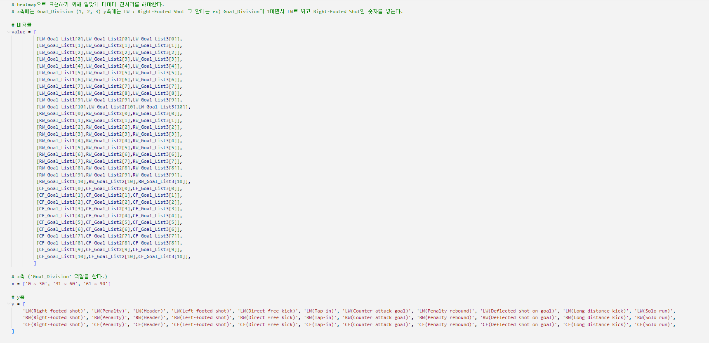
\
\
\
\
\
비로소 DataFrame를 만들고, Seaborn Heatmap으로 데이터 시각화 한다.
시각화 그래프에 대한 크기, 배경색 그리고 폰트 사이즈까지 설정한다.

\
\
\
시각화한 그래프다.

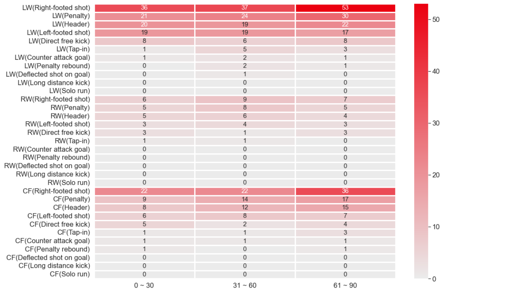
\
\
\
\
6.데이터 분석 결과
============   

1. 호날두 명성에 비해, 프리킥 골은 손꼽힐만큼 적다.

2. 데이터 클린징으로 698개에서 65개 줄어든 635개에서
   패널티 킥이 100개보다 많다. 즉 패널티 킥을 통한 골이 많다.

3. 호날두는 후반으로 갈수록 공격 포인트가 많다.

4. RW으로 나선 호날두는 LW, CF에 비해 활약도가 적다.

5. 오른발이 주발답게, 오른발을 통한 골이 가장 많다.

6. 왼발 또한 잘쓴다. 특히 LW로 나설 떄 알 수 있다.

7. LW에서 헤더 골을 많이 기록했다. 호날두는 슛뿐만 아니라 헤더능력도 좋다.

7.차별화 포인트
=================

1. 3개 변수를 이용하여 입체적으로 데이터 분석/시각화 했다.

8.수업을 마치며 느낀점
============   

__자신이 원하는 데이터 구조를 만들기 위해 날밤을 새우다가도, 구글링을 통해 영감을 받는다.
그것이 바로 데이버 분석/시각화다.__

대학교에 입학하고 4학년인 지금까지 나의 주관심 분야는 개발/프로그래밍 영역이다.
구체적으로 말하면 Java/Kotlin을 통한 모바일 앱 개발이다. 하지만 데이터 사이언스 영역의 인공지능, 크롤링과 같은 기술과 모바일 기술을 융합해 새로운 콘텐츠를 만들 수 있다는 것을 알게 되었다. 내가 빅데이터 수업을 듣게 된 배경도 그러한 맥락과 관련있다.

수업을 듣고, 데이터 분석 파이프라인을 통해 실습하면서 데이터가 지닌 중요성을 느꼈다.
그리고 여러 전문가가 IT 시대가 아니라 DT 시대라고 말하는 것을 이해할 수 있었다.흩뿌려진 데이터를 모아 상황을 판단하고, 예측까지 할 수 있기 떄문이다.
하지만 내가 원하는 답을 찾기까지 과정이 결코 쉽지 않다. 기호에 맞는 데이터를 찾기 힘들기 떄문이다. 결국 데이터 클린징, 전처리, 조직화 하는 작업이 필요하다. 데이터사이언티스트가 하는 일의 업무 중에 80%임을 수업을 통해 들었지만, 실습을 통해 체감할 수 있었다.
위 작업을 수행하면서 시행착오를 많이 겪었다. 문법도 문법이지만, 더 큰 문제는 어떻게 전처리, 조직화 해야 분석 결과를 도출하고 시각화가 가능한지에 대한 질문이었다. 구글링을 통해 영감을 얻다가도, 다음 단계를 진행하려 하면 막혀서 몇 시간을 붙잡기도 했다. 
하지만 결국 내가 보고 싶어했던 부분을 눈으로 확인할 수 있었다. 

   

